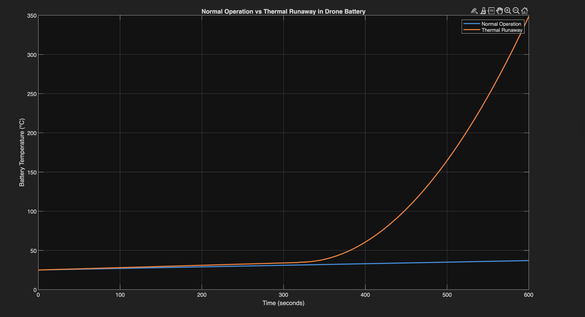
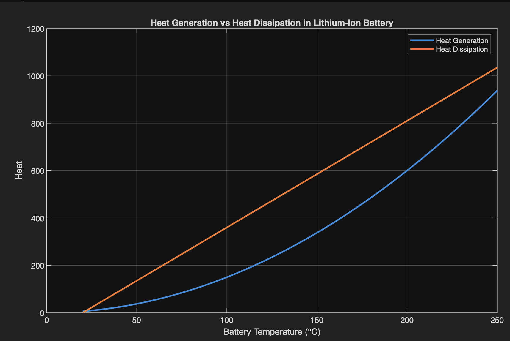
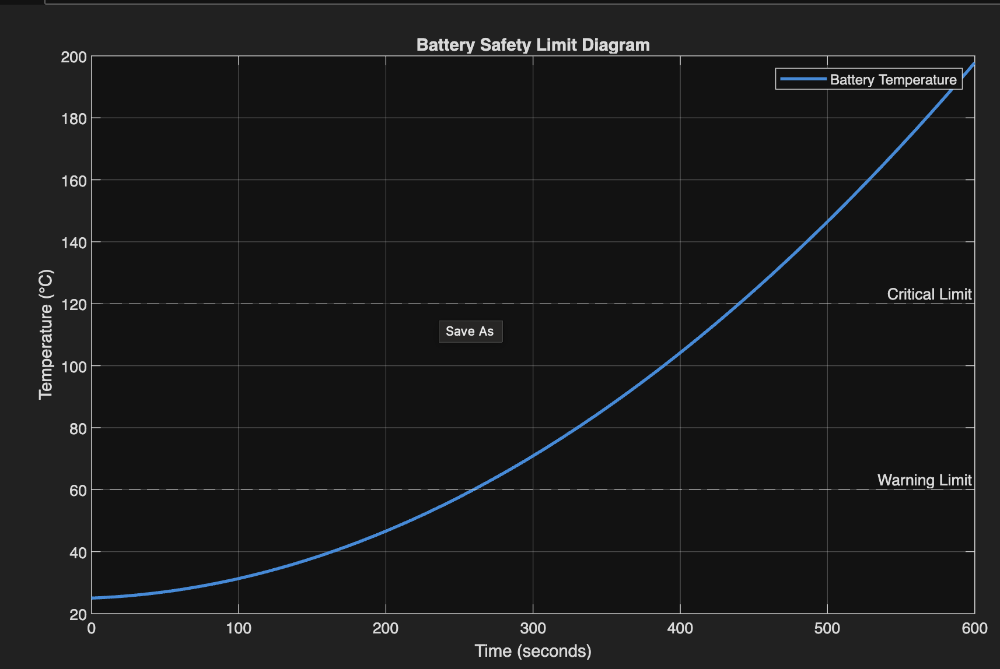
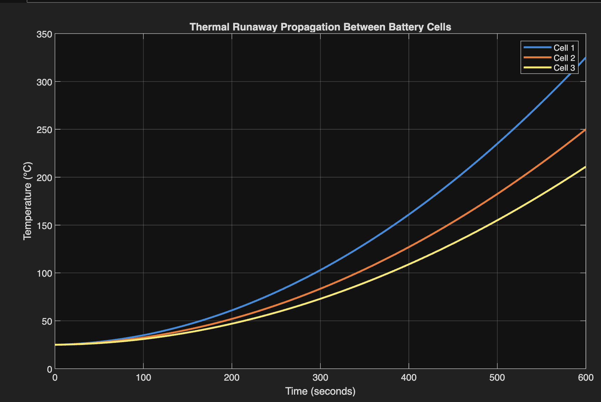
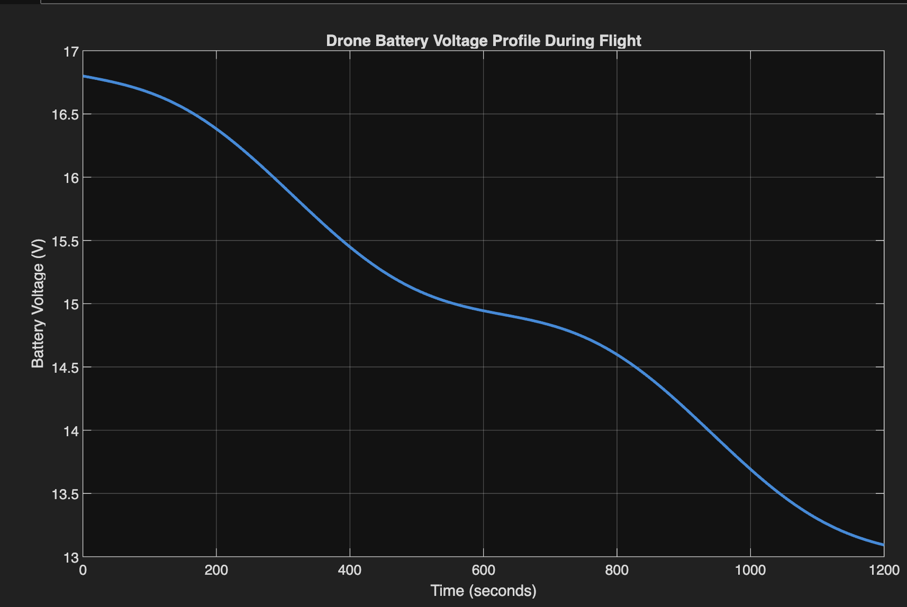
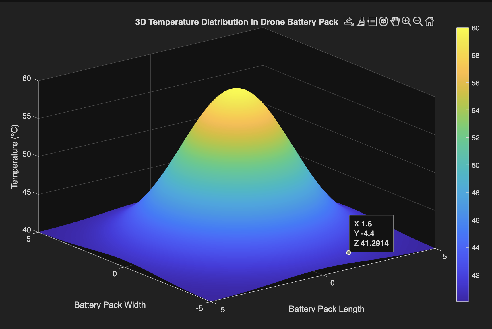

# Comprehensive Thermal Instability Evaluation of Drone-Integrated Battery Module Architectures

## Course
Drone Technologies and its Transformative Applications  
CIA 3 – Project Activities  

## Students
Sai Madhukar K – Register Number: 2362873
Anish S – Register Number:2362871

## Project Description
This project evaluates the thermal instability behavior of lithium-ion batteries used in drone systems under heat stress conditions. The objective is to analyze temperature rise, heat generation, and thermal runaway behavior during abnormal operating conditions.

A simulation-based approach was used to study the thermal characteristics of drone battery modules. Mathematical models were implemented to analyze heat generation and heat dissipation within the battery system.

## Key Objectives
- Simulate temperature rise during abnormal battery operation.
- Analyze heat generation vs heat dissipation.
- Identify battery safety temperature limits.
- Study thermal runaway propagation between battery cells.
- Analyze drone battery voltage behavior during operation.
- Visualize 3D temperature distribution across the battery pack.

---

# Simulation Results

## Normal Operation vs Thermal Runaway

## Heat Generation vs Heat Dissipation

## Battery Safety Temperature Limits

## Thermal Runaway Propagation

## Drone Battery Voltage Profile

## 3D Temperature Distribution

---

# Tools Used
- MATLAB (simulation)
- LaTeX (report preparation)
- GitHub (project submission)

---

# Repository Structure
